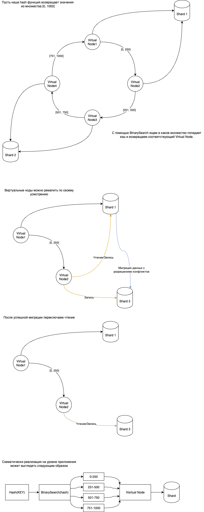
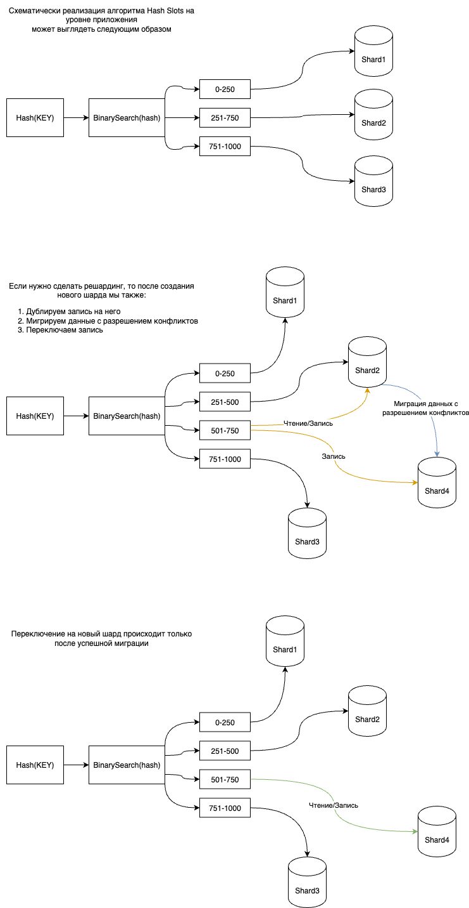

# Что такое Шардирование?
Чтобы ответить на этот вопрос, нам нужно вспомнить что такое партицирование.
Партицирование - это разделение одной большой таблицы на несколько меньших, логически связанных частей (партиций).
Каждая партиция, например, может хранить данные, попадающие в некоторый набор ключей или данные разбитые по месяцам.

Шардирование - это по сути партицирование, но на уровень выше. Здесь, каждый шард хранит данные из определённого набора ключей. Например, данные с хэшами ключами из набора от 0 до 9 попадают на первый шард, от 10 до 20 на второй, от 21 до N на третий.

# Подходы к распределению ключей
Два основных подхода для распределения ключей, которые работают с приемлемой производительностью - это Consistent Hashing и Hash Slots, который является специфичной реализацией Consistent Hashing.

## Consistent Hashing

## Hash Slots
