# Что такое Шардирование?
Чтобы ответить на этот вопрос, нам нужно вспомнить что такое партицирование.
Партицирование - это разделение одной большой таблицы на несколько меньших, логически связанных частей (партиций).
Каждая партиция, например, может хранить данные, попадающие в некоторый набор ключей или данные разбитые по месяцам.

Шардирование - это по сути партицирование, но на уровень выше. Здесь, каждый шард хранит данные из определённого набора ключей. Например, данные с хэшами ключами из набора от 0 до 9 попадают на первый шард, от 10 до 20 на второй, от 21 до N на третий.

# Подходы к распределению ключей
Два основных подхода для распределения ключей, которые работают с приемлемой производительностью - это Consistent Hashing и Hash Slots, который является специфичной реализацией Consistent Hashing.

## Consistent Hashing
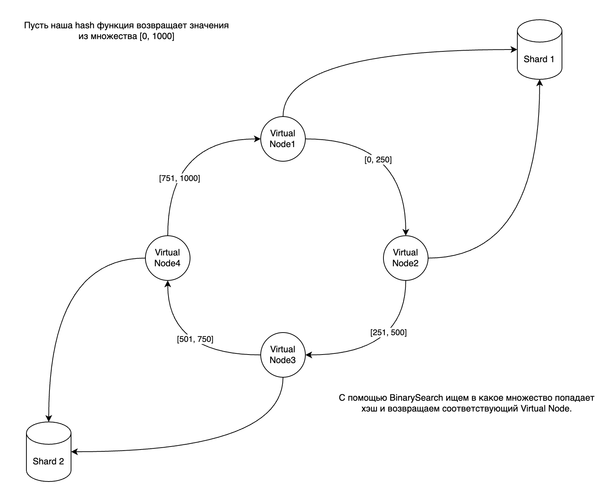
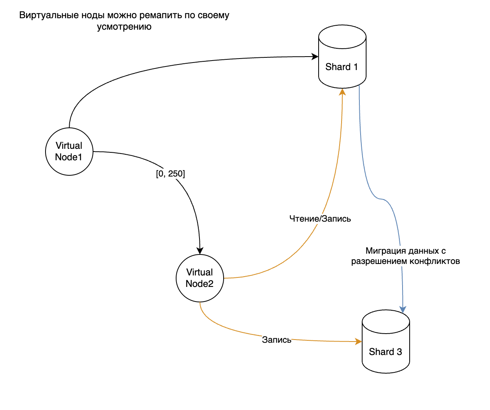
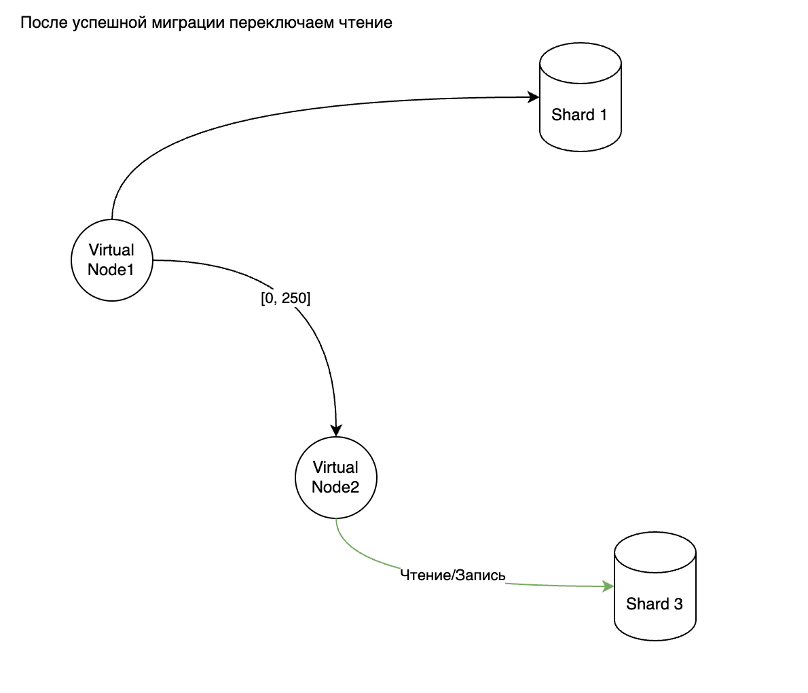
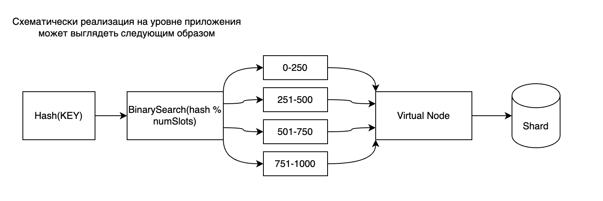

## Hash Slots
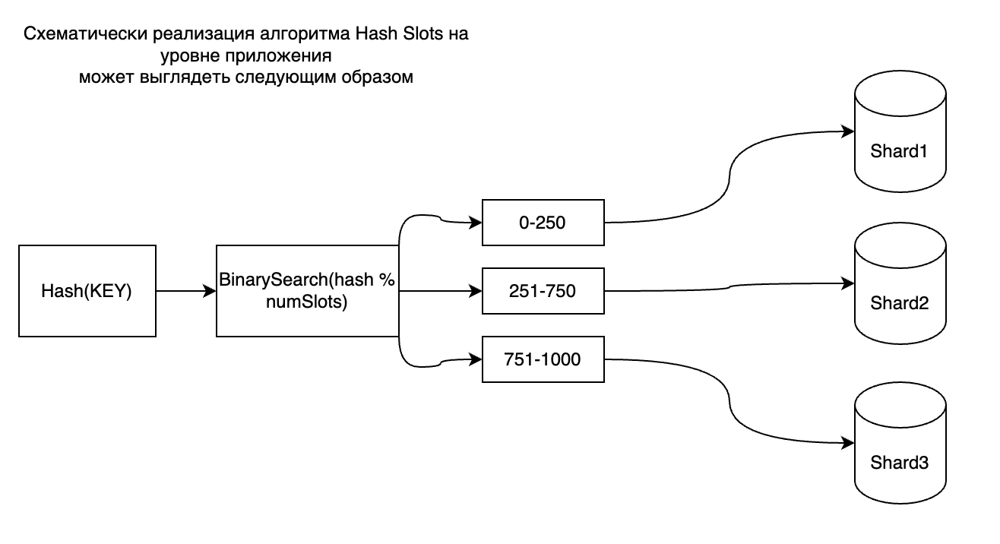
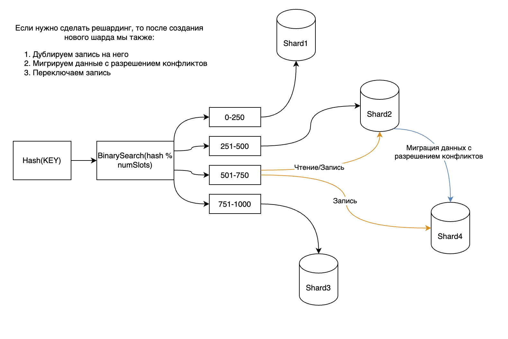
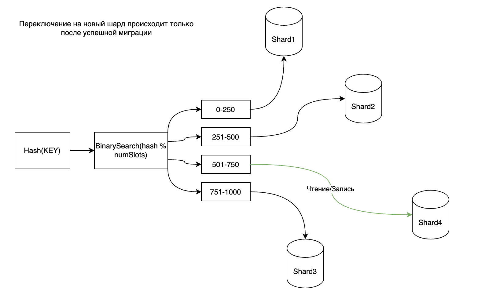

# Решардирование на практике
На практике решардирование происходит следующим образом:
- Создание новой бд
- Настройка логической репликации из старой бд в новую (миграция). Запись Всё ещё идёт в старую бд.
- Переключение логической репликации. Пулер начинает видеть новую бд. Запись в старую бд блокируется, но чтение остаётся.
- Переключение dsn в приложении со старой бд на новую. Чтение и запись идёт с новой бд.
- Чистка данных в старой и новой бд
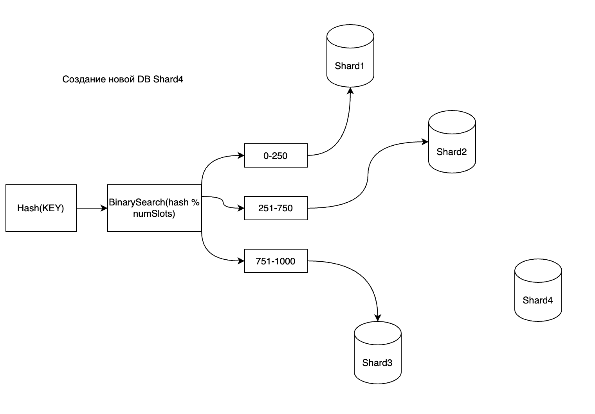
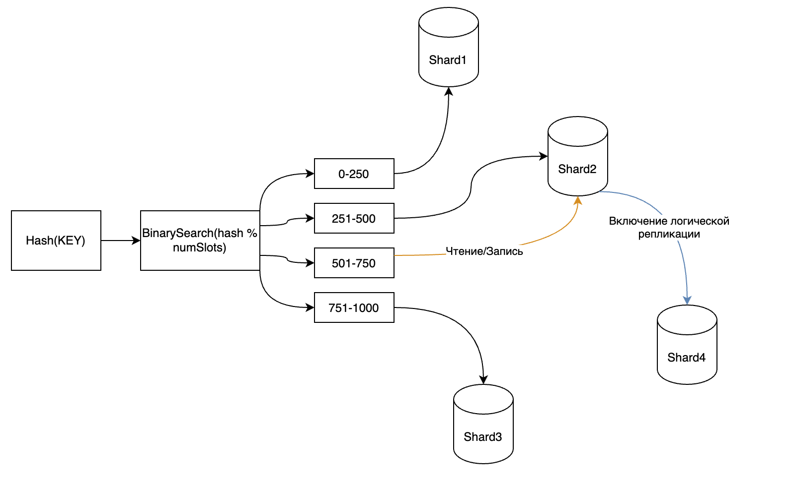
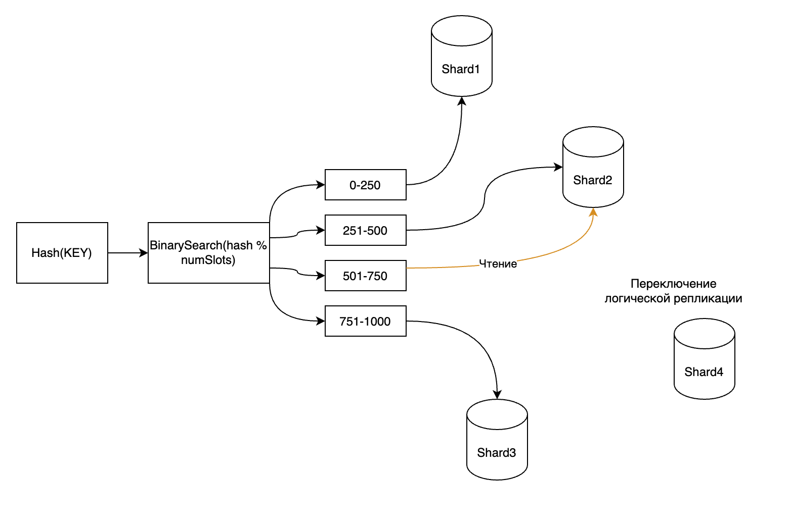
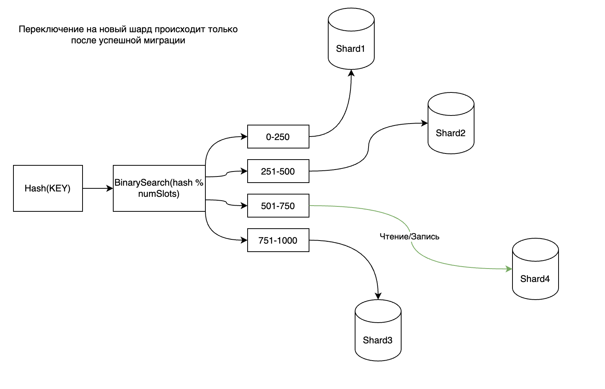

# Платформенное шардирование
В платформенном шардировании единицой шардирования считается бакет, представляющий собой схему бд. Каждый бакет имеет формат bucket_N, где N - это число из мн-ва [0, NumBickets-1].

Кол-во бакетов выбирается заранее и не может быть изменено. Схемы физически лежат в одном экземпляре постгреса и это значит, что обращения к ним переиспользуют подключения к постгресу.
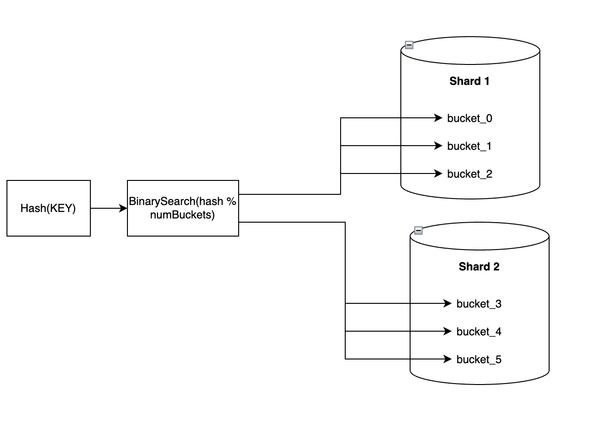

Основное отличие платформенного шардирования от кастомного заключается в том, что в кастомном шардировании каждый шард содержит только одну схему (public) и работа идёт с ней, а в платформенном шардировании каждый шард содержит от одной схемы (bucket_N) и больше. Поэтому при выполнении запроса нам всегда нужно указывать в какой именно бакет мы идём (платформа это делает за нас).

Решардирование происходит таким же образом как описано выше. Бакеты могут свободно перевозиться между шардами.
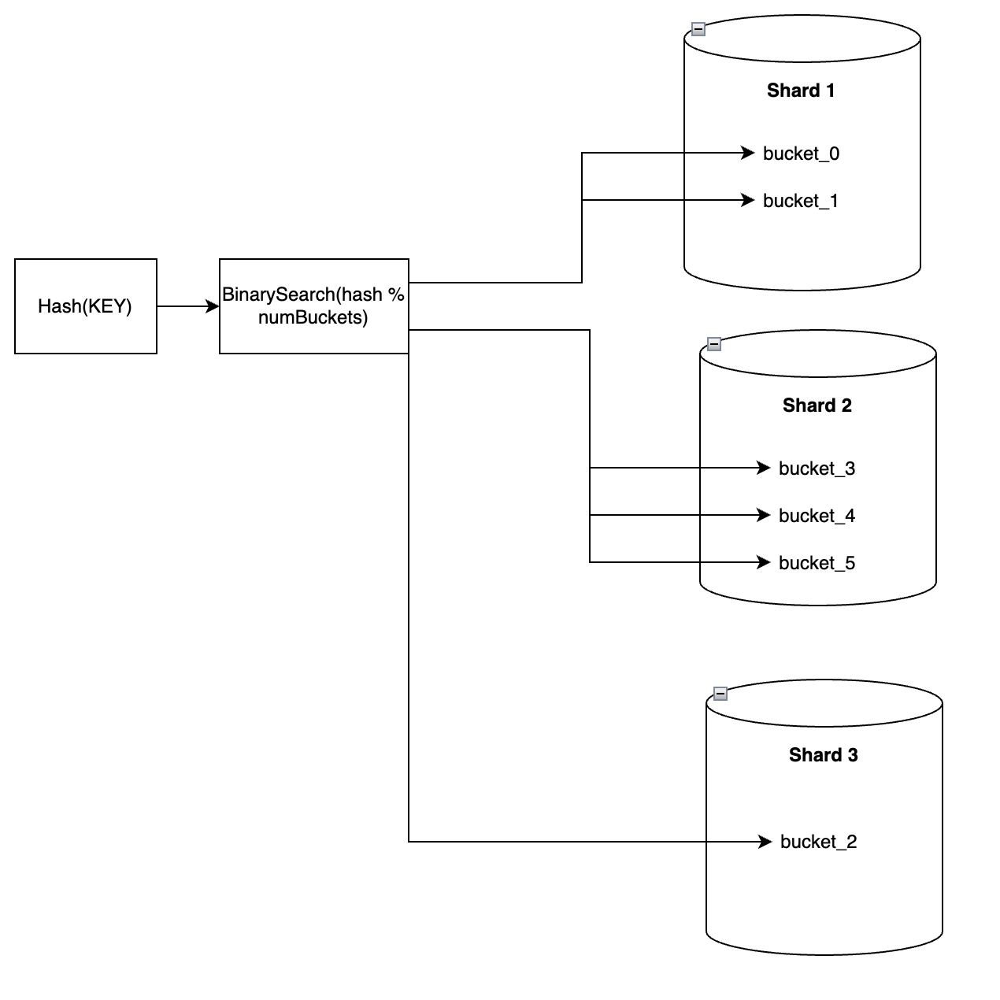

## Hash Slots в платформенном шардировании
Алгоритм Hash Slots значительно упрощается и мы можем отказаться от шага бинарного поиска попадания в рэнж.

[draw io](https://drive.google.com/file/d/1zV89OmwcVRKu29vF_zVoonifr66AiDu8/view?usp=sharing)
